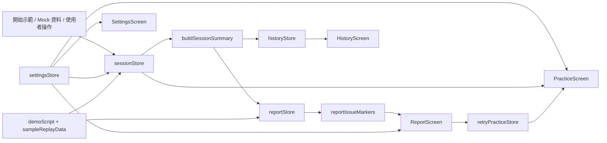

# 說來話長 TalkFit

> 線上展示：<https://talkfit.swift.moe/>

[](https://talkfit.swift.moe/)
[](https://github.com/swiftruru/SpeakCoach-TalkFit)
[](https://react.dev/)
[](https://www.typescriptlang.org/)
[](https://vite.dev/)
[](https://tailwindcss.com/)
[](https://zustand-demo.pmnd.rs/)


TalkFit 是一個以 iOS 體驗為目標打造的互動式 Web 原型，主題聚焦在「演講練習時的贅字與語速回饋」。  
目前這個網站版本不會真的開啟麥克風錄音，而是用示範回放、Mock 資料與互動式報告流程，驗證產品資訊架構、教練式回饋與作品展示方式。

---

## 線上展示截圖

> 網站建議使用桌面瀏覽器開啟，以獲得完整的手機框模擬與註解面板體驗。

[](https://talkfit.swift.moe/)

_截圖展示 TalkFit 的分析報告畫面：左側為章節導覽，中間為 iPhone 原型，右側為註解面板，頂部可直接操作示範流程與 Mock 資料。_

---

## 為什麼是 TalkFit

### 這個產品想解決什麼？

練演講、做簡報、準備產品展示時，最難察覺的往往不是內容，而是自己聽不到的語言習慣：  
例如「嗯」、「然後」、「這個」、「對不對」，或是因為緊張而不自覺越講越快。

這些問題通常有三個痛點：

- 自己事後回聽很痛苦，也很少有人真的願意反覆聽自己的錄音
- 朋友或同事不一定會直接指出你的口頭禪
- 等到正式上台才發現問題，已經來不及修正

TalkFit 的核心概念，就是把這些原本只能「事後懊悔」的問題，提前變成「練習當下就能感受到」的回饋。

### 為什麼用這種方式設計？

- **即時回饋**：使用者練習時就能看到語速與贅字變化，而不是只拿到最後一份靜態報告
- **低打擾提醒**：產品概念是以裝置端辨識與輕量提醒為核心，不打斷使用者節奏
- **可追蹤進步**：每次練習留下報告與歷史趨勢，讓「我好像有比較好」變成可驗證的變化
- **先用原型驗證產品價值**：在真正進入 iOS 實作前，先把資訊架構、互動節奏、資料呈現方式跑通

### 這個原型想證明什麼？

這個原型不是單純把畫面做漂亮，而是要驗證以下幾件事：

1. 使用者能不能在 10 秒示範內理解產品價值
2. 即時逐字稿、贅字標記與語速資訊能不能形成一個清楚的回饋閉環
3. 報告頁與歷史頁是否足以支撐「持續練習」的動機
4. 未來移植到 iOS / Apple Intelligence on-device 流程時，互動模型是否已經成熟

---

## 核心功能

- **原型練習模式**：網站版不實際收音，以計時、波形、示範回放與報告互動驗證產品體驗
- **贅字偵測**：在逐字稿中即時標記填充音、連接贅詞、指示贅詞與慣性尾句
- **語速儀表板**：以圓弧儀表即時顯示字／分鐘，並用顏色區分偏慢、適中、偏快
- **語速曲線圖**：在報告頁中回看整段練習的語速波動與建議區間
- **問題片段跳轉**：可點擊贅字排行榜與異常語速點，直接跳到逐字稿對應片段並高亮顯示
- **問題片段一鍵重練**：從報告頁直接把某段問題片段送回練習頁，聚焦修正單一問題
- **練習目標設定**：可選擇本輪是要少講贅字、穩住語速，或優先壓低最常出現的口頭禪
- **教練式建議**：報告頁會整理本次目標結果，並給出下一輪先改的 3 件事
- **離開前確認視窗**：錄音中的練習畫面若誤觸導航，不會直接離開，而是先跳出 iPhone 風格確認視窗
- **進站啟動畫面**：直接開啟網站時，先播放網站層開場，再接手機模擬器內的 App 啟動動畫
- **原型章節導覽**：桌面版以左側浮動導覽條顯示目前章節、示範進度與步驟摘要，方便評審快速理解網站結構
- **畫面深連結**：網址會同步目前畫面狀態，可直接分享指定頁面的展示連結
- **一鍵重置原型**：可清除所有練習資料、目前報告與展示狀態，回到乾淨起點
- **分享卡匯出**：透過專用 `ReportShareCard` 版型匯出 `PNG` / `SVG`，適合放進作品集、hackathon submission 或社群貼文
- **流暢度評分**：依據贅字頻率與語速表現給出 A+ ~ D 的簡化評分
- **歷史趨勢紀錄**：累積每次練習結果，觀察贅字數量與整體表現變化
- **練習情境設定**：支援 `面試自介`、`專題簡報`、`Demo Pitch`，一鍵同步語速範圍與預設贅字類型
- **自訂贅字清單**：可開關預設詞，也能新增自訂贅字，保留個人化調整
- **無麥克風示範流程**：點擊 `開始示範` 後，先跑 10 秒 sample session，再自動導覽重點頁面
- **註解面板**：每個畫面都有對應說明，方便作品集展示、課堂展示與評審導覽

---

## 畫面一覽

| 畫面 | 說明 |
|------|------|
| 首頁 | 顯示本週練習次數、平均贅字、每日趨勢與今日提醒 |
| 練習中 | 顯示原型錄音狀態、語速儀表、波形、練習目標與片段重練提示 |
| 分析報告 | 顯示平均語速、贅字排行、語速曲線、問題片段跳轉、逐字稿標記、下一輪建議、片段一鍵重練與分享卡預覽 / 匯出 |
| 歷史紀錄 | 顯示累積練習統計、趨勢圖與每次練習列表 |
| 設定 | 可調整偵測開關、情境設定、練習目標、贅字清單、語速範圍、語言與回饋方式 |

### 網站操作體驗

- **進站啟動畫面**：直接進站時會先播放網站層開場，接著在手機模擬器內模擬 App 被打開的動畫；若使用深連結或系統偏好減少動態，會自動跳過
- **左側浮動導覽列**：桌面版將章節導覽固定在手機左側，不佔用主畫面的垂直空間
- **示範步驟摘要**：示範進行中會在左側導覽列顯示當前步驟的簡短說明，而不只是顯示進度
- **深連結分享**：網址會同步 `screen` 與 `panel` 狀態，例如 `?screen=report`、`?screen=report&panel=open`
- **畫面連結按鈕**：可直接複製目前正在展示的原型畫面網址
- **重置原型按鈕**：會清空所有練習紀錄、目前報告與示範狀態，方便重新 demo

---

## 架構 / 資料流



### 資料流重點

- **互動入口**：首頁操作、設定、示範腳本與報告頁互動，最後都會回到 `sessionStore` / `reportStore` 這兩個核心狀態
- **網站導覽層**：`AppLaunchOverlay`、`PrototypeNavigator` 與 URL query 共同負責進站節奏、章節切換、進度顯示與畫面深連結
- **分析層**：練習資料經過 `buildSessionSummary`、評分邏輯、目標評估與 coaching helper，整理成可展示的摘要
- **狀態層**：練習中狀態放在 `sessionStore`；練習結束後整理成 `reportStore` 與 `historyStore`
- **設定層**：`settingsStore` 控制語速範圍、情境設定、練習目標、贅字清單、語言與回饋方式
- **展示層**：`PracticeScreen`、`ReportScreen`、`HistoryScreen`、`SettingsScreen` 各自訂閱對應 store；報告頁再透過 marker helper 串起圖表、逐字稿定位、分享卡與片段重練入口
- **示範層**：`demoScript` 與 `sampleReplayData` 可在不開麥克風的情況下重現完整產品價值
- **重練層**：`retryPracticeStore` 讓使用者能從報告指定單一問題片段，再帶著修正提示回到練習頁

---

## 技術堆疊

| 分層 | 技術 |
|------|------|
| 框架 | React 19 + TypeScript + Vite |
| 樣式 | Tailwind CSS + CSS Variables |
| 狀態管理 | Zustand（含 `localStorage` 持久化） |
| 動畫 | Framer Motion |
| 圖表 | Recharts |
| 原型互動 | Mock Data + Sample Replay Script + Session/Report Store |
| 視覺回饋 | Scripted Waveform + SVG Share Card Export |

---

## 快速開始

```bash
npm install
npm run dev
```

啟動後請打開終端機顯示的本機網址。Vite 預設通常是 <http://localhost:5173>，但如果該連接埠已被占用，會自動改用其他埠號。

---

## 頂部按鈕說明

| 按鈕 | 功能 |
|------|------|
| `✦ 設計動機` | 開啟產品概念與參賽動機說明 |
| `✦ Mock 資料` | 一鍵載入示範用練習紀錄與報告 |
| `▶ 開始示範` | 先播放示範回放，再自動導覽報告、首頁、歷史與設定；流程結束後會自動停止 |
| `重置原型` | 清除所有練習資料與目前報告，回到乾淨的首頁狀態 |
| `畫面連結` | 複製目前畫面網址，方便直接分享指定展示頁 |
| `亮色 / 暗色` | 切換主題 |

---

## 專案結構

```text
src/
├── screens/          # 各主畫面：首頁、練習、報告、歷史、設定
├── components/
│   ├── PrototypeNavigator  # 原型章節導覽與進度列
│   ├── AppLaunchOverlay    # 網站進站開場動畫
│   ├── report/       # 分享卡元件與報告頁專用視覺輸出
│   ├── shell/        # PhoneFrame、StatusBar、TabBar 等外框元件
│   └── AboutSection  # 產品概念與設計故事
├── demo/             # 示範流程與示範回放資料
├── hooks/            # 波形動畫、拖曳捲動等互動 hook
├── stores/           # navigation、session、report、history、settings、retryPractice 等狀態
├── lib/              # 分析邏輯、評分、贅字資料、情境設定、示範資料、原型狀態、分享卡與片段重練 helper
├── annotation/       # 註解面板與各頁註解內容
└── types/            # 共用型別

public/
└── app-icon.png

docs/
└── images/
    └── talkfit-live-site-report.png
```

---

## 備註

- 目前這個網站版本不會要求麥克風權限，也不會真的錄音；重點是驗證產品流程、報告邏輯與互動細節
- 波形在練習中會持續動畫，用來維持原型的節奏感與視覺回饋
- `開始示範` 會先跑 10 秒 sample session，再自動帶到報告、首頁、歷史與設定；結束後會自動停止示範模式
- 直接開啟網站時，會先播放網站開場，再接手機模擬器內的 App 啟動動畫；若使用深連結或偏好減少動態，會自動跳過
- `重置原型` 會清除所有練習資料與目前報告，不會自動重新塞回 mock 練習紀錄
- 畫面網址會同步目前章節，適合直接分享指定原型頁面給評審或面試官
- 套用情境設定後，若使用者手動調整語速滑桿或贅字清單，系統會自動切回 `custom`
- 分享卡匯出不使用整頁截圖，而是獨立的 `ReportShareCard` 版型；畫面預覽與實際輸出解析度分離，匯出更穩定
- 錄音中的練習畫面若誤觸導覽按鈕，會先跳出確認視窗，避免直接離開
- 所有練習資料都保留在瀏覽器端的 `localStorage`，不會上傳到雲端
