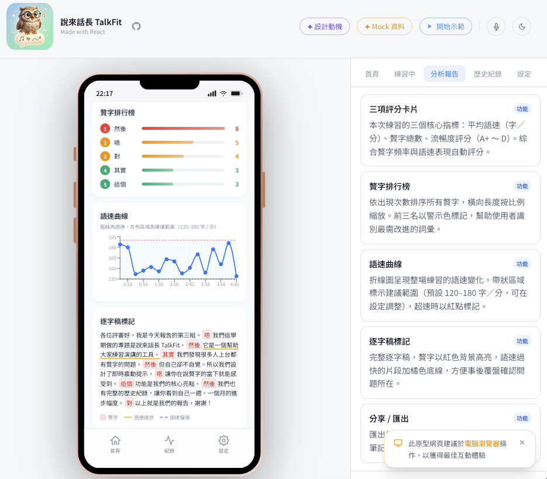
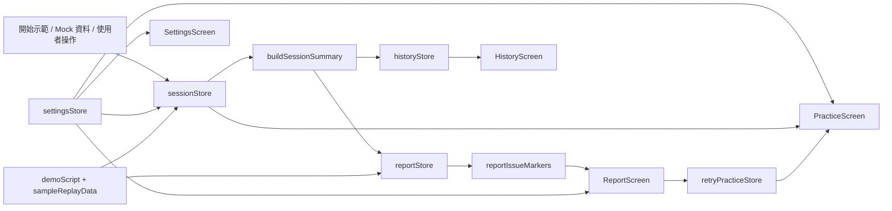

# 說來話長 TalkFit

> 線上展示：<https://talkfit.swift.moe/>

[](https://talkfit.swift.moe/)
[](https://github.com/swiftruru/SpeakCoach-TalkFit)
[](https://react.dev/)
[](https://www.typescriptlang.org/)
[](https://vite.dev/)
[](https://tailwindcss.com/)
[](https://zustand-demo.pmnd.rs/)


TalkFit 是一個以 iOS 體驗為目標打造的互動式 Web 原型，主題聚焦在「演講練習時的贅字與語速回饋」。  
目前這個網站版本不會真的開啟麥克風錄音，而是用示範回放、Mock 資料與互動式報告流程，驗證產品資訊架構、教練式回饋與作品展示方式。

---

## 線上展示截圖

> 網站建議使用桌面瀏覽器開啟，以獲得完整的手機框模擬與註解面板體驗。

[](https://talkfit.swift.moe/)

_截圖展示 TalkFit 的分析報告畫面：左側為章節導覽，中間為 iPhone 原型，右側為註解面板，頂部可直接操作示範流程與 Mock 資料。_

---

## 為什麼是 TalkFit

### 這個產品想解決什麼？

練演講、做簡報、準備產品展示時，最難察覺的往往不是內容，而是自己聽不到的語言習慣：  
例如「嗯」、「然後」、「這個」、「對不對」，或是因為緊張而不自覺越講越快。

這些問題通常有三個痛點：

- 自己事後回聽很痛苦，也很少有人真的願意反覆聽自己的錄音
- 朋友或同事不一定會直接指出你的口頭禪
- 等到正式上台才發現問題，已經來不及修正

TalkFit 的核心概念，就是把這些原本只能「事後懊悔」的問題，提前變成「練習當下就能感受到」的回饋。

### 為什麼用這種方式設計？

- **即時回饋**：使用者練習時就能看到語速與贅字變化，而不是只拿到最後一份靜態報告
- **低打擾提醒**：產品概念是以裝置端辨識與輕量提醒為核心，不打斷使用者節奏
- **可追蹤進步**：每次練習留下報告與歷史趨勢，讓「我好像有比較好」變成可驗證的變化
- **先用原型驗證產品價值**：在真正進入 iOS 實作前，先把資訊架構、互動節奏、資料呈現方式跑通

### 這個原型想證明什麼？

這個原型不是單純把畫面做漂亮，而是要驗證以下幾件事：

1. 使用者能不能在 10 秒示範內理解產品價值
2. 即時逐字稿、贅字標記與語速資訊能不能形成一個清楚的回饋閉環
3. 報告頁與歷史頁是否足以支撐「持續練習」的動機
4. 未來移植到 iOS / Apple Intelligence on-device 流程時，互動模型是否已經成熟

---

## 近期更新

- **網站進站節奏**：新增網站層 `AppLaunchOverlay` 與手機模擬器內的 App 啟動動畫，直接開站時會先建立節奏再進入內容；可用右上角 `略過` 或 `Esc` 提前跳過，若使用深連結或系統偏好減少動態也會自動略過
- **網站新手導覽**：桌面首次進站會自動開啟逐步導覽，依序介紹頂部工具列、展示工具、左側導覽、手機模擬器與右側說明面板，也可從 `更多` 或 `⌘K / Ctrl+K` 再次開啟
- **展示控制升級**：頂部工具列已改成分組式操作，搭配 `Command Palette`、快捷鍵、全螢幕、簡報模式與簡潔 HUD，讓面試 demo、投影展示與作品集錄影更順手
- **錄音完成回饋升級**：停止錄音後會先出現底部完成卡，提供 `查看完整報告`、`立刻重練` 與 `回首頁` 三個下一步；完成卡打開時也會中止背景倒數，避免畫面層互相干擾
- **註解覆蓋補齊**：右側說明面板已補上更多實際畫面區塊，包含報告頁的一句總結、快速摘要卡、贅字排行榜，設定頁的推薦 / 進階切換，以及錄音中的目標進度卡
- **觸控指示點置頂**：手機模擬器的觸控圓點與 ripple 已獨立提升到最上層，分析中、完成卡或其他 overlay 出現時，觸控位置仍會清楚可見
- **輸出與分享**：網站畫面可從匯出 modal 選擇 `展示版 / 乾淨版 / 純手機版` 三種 PNG；報告頁的分享卡則獨立支援 `PNG` / `SVG`
- **語言與深連結**：網站外殼、模擬器內容、示範文案、說明卡與 Mock 資料都能即時切換繁中 / 英文，網址也會同步 `screen`、`panel`、`annotation`、`demo`、`step`、`theme`、`view` 等展示狀態

---

## 核心功能

- **原型練習模式**：網站版不實際收音，以計時、波形、示範回放與報告互動驗證產品體驗
- **贅字偵測**：在逐字稿中即時標記填充音、連接贅詞、指示贅詞與慣性尾句
- **語速儀表板**：以圓弧儀表即時顯示字／分鐘，並用顏色區分偏慢、適中、偏快
- **語速曲線圖**：在報告頁中回看整段練習的語速波動與建議區間
- **問題片段跳轉**：可點擊贅字排行榜與異常語速點，直接跳到逐字稿對應片段並高亮顯示
- **問題片段一鍵重練**：從報告頁直接把某段問題片段送回練習頁，聚焦修正單一問題
- **自動 3-2-1 倒數**：進入練習頁後會先短暫顯示練前確認卡，接著自動進入倒數，不需要再手動按開始
- **練前確認卡**：開始前先顯示本次目標、練習情境、建議語速與提醒，片段重練時也會直接帶出原始片段與修正提示
- **練習專注模式**：可將練習中的資訊收斂成關鍵指標，降低波形、逐字稿與次要統計的干擾
- **練習目標進度卡**：錄音中會持續顯示這輪的目標、當前進度與是否接近達標，讓使用者在講的當下就知道自己有沒有往正確方向修正
- **分析中過場**：按下停止後不會直接硬切報告，而是先短暫顯示分析中狀態，再進入分析結果
- **停止後行動卡**：練習結束後會先提供看報告、立刻重練或回首頁的下一步選擇，不用再自己找出口
- **練習目標設定**：可選擇本輪是要少講贅字、穩住語速，或優先壓低最常出現的口頭禪
- **單一句總結**：報告頁會先用一句最優先建議整理這輪最該先修的方向，再進入完整分析
- **本次三重點**：報告頁最上方先整理本次結論、最需要注意的地方與下一步，先看重點再決定是否往下看詳細圖表
- **摘要 / 詳細切換**：報告頁可在精簡摘要與完整圖表之間切換，先看結論再決定要不要深入細節
- **重練完成回饋**：若報告是由片段重練產生，會額外整理這次是否比原本更好，並提供再次重練或繼續查看報告的操作
- **教練式建議**：報告頁會整理本次目標結果，並給出下一輪先改的 3 件事
- **歷史快速比較**：可直接從歷史紀錄挑兩筆結果，比較贅字、語速、時長與最常贅字變化
- **比較結果摘要**：歷史頁會先用一句總結說明哪裡進步、哪裡需要注意，不只顯示數值差異
- **首頁任務卡**：首頁會把最近一次練習整理成「今天先做什麼」，先回看報告或直接回去重練上次問題
- **同情境再練**：歷史頁可直接帶回某次練習的情境設定與目標，再開一輪相同情境
- **離開前確認視窗**：錄音中的練習畫面若誤觸導航，不會直接離開，而是先跳出 iPhone 風格確認視窗
- **進站啟動畫面**：直接開啟網站時，先播放網站層開場，再接手機模擬器內的 App 啟動動畫
- **原型章節導覽**：桌面版以左側雙欄浮動導覽顯示目前章節、示範進度、步驟摘要與展示控制，方便評審快速理解網站結構
- **導覽說明跟隨**：左側浮動導覽的說明卡會跟著目前聚焦的模擬器區塊上下移動，避免到報告頁下半部時脫離視線
- **說明面板分頁**：右側說明面板每頁最多顯示 4 個說明項目；當 demo 或 hover 聚焦到較後面的功能時，會自動切換到對應頁面
- **自動 Spotlight 聚焦**：桌面版 hover 或 demo 聚焦到功能區塊時，會自動壓暗其餘區域，只保留單一手機區塊與對應說明卡
- **新手導覽 Overlay**：第一次進站時，桌機版會以逐步框選的方式介紹頂部工具列、展示工具、左側導覽、手機模擬器與右側說明面板，也可從 `更多` 或 `Command Palette` 手動重新開啟
- **簡報模式**：可切換成更乾淨的展示版面，收起頂部工具列並改用精簡 HUD 操作
- **快速操作 Command Palette**：支援 `⌘K` / `Ctrl+K`，可快速跳頁、開始示範、切換簡報模式、進入全螢幕、開啟輸出畫面與執行重置
- **快捷鍵操作**：支援 `?`、`⌘K / Ctrl+K`、`D`、`P`、`F`、`E`、`A`、`R`、`T`、`S`、`L` 等桌面快捷鍵，提升作品集展示與面試 demo 效率
- **全螢幕展示**：整合瀏覽器 `Fullscreen API`，可直接進入真正的全螢幕展示
- **截圖 / 乾淨輸出**：內建 PNG 匯出面板，可輸出作品集展示版、乾淨展示版與純手機版
- **匯出署名資訊**：PNG 匯出會在留白區低調附上作者資訊，方便作品集與分享圖保留來源
- **畫面深連結**：網址會同步目前畫面狀態，可直接分享指定頁面的展示連結
- **中英文即時切換**：整個網站包含模擬器內容、示範文案、說明卡與 Mock 資料都支援繁中 / 英文切換
- **右上角單鍵語言切換**：頂部最右側提供單一語言切換按鈕，一鍵在繁中與英文之間即時切換
- **英文版面換行保護**：針對首頁統計卡、報告分數卡、歷史摘要卡與設定副標補上多行換行與高度保護，避免英文介面截斷或擠壓
- **一鍵重置原型**：可清除所有練習資料、目前報告與展示狀態，回到乾淨起點
- **分享卡匯出**：透過專用 `ReportShareCard` 版型匯出 `PNG` / `SVG`，適合放進作品集、hackathon submission 或社群貼文
- **流暢度評分**：依據贅字頻率與語速表現給出 A+ ~ D 的簡化評分
- **歷史趨勢紀錄**：累積每次練習結果，觀察贅字數量與整體表現變化
- **練習情境設定**：支援 `面試自介`、`專題簡報`、`Demo Pitch`，一鍵同步語速範圍與預設贅字類型
- **推薦 / 進階設定分層**：設定頁可先看常用項目，再展開完整進階設定，降低第一次進入設定頁的負擔
- **自訂贅字清單**：可開關預設詞，也能新增自訂贅字，保留個人化調整
- **完整示範流程**：點擊左側浮動導覽中的 `開始示範` 後，會先跑 10 秒 sample session，再完整導覽詳細報告、分享卡匯出、歷史紀錄、設定與首頁收尾
- **註解面板**：每個畫面都有對應說明，方便作品集展示、課堂展示與評審導覽
- **互動式註解導引**：桌面版 hover 模擬器或右側說明卡時，會同步高亮對應區塊，並以暖橘色箭頭連接兩側內容
- **註解覆蓋補齊**：說明面板目前已完整覆蓋練習中、報告、歷史與設定頁的重要區塊，不只主卡片，像摘要模式快速摘要卡、贅字排行榜與設定模式切換也都有對應說明
- **說明卡固定**：可將右側說明卡固定，鎖定對應高亮與箭頭導引，方便停留在單一功能上講解
- **觸控指示點置頂**：模擬器內的觸控圓點與 ripple 會維持在最上層，不會被分析中或停止後的 overlay 蓋住
- **設計動機 / 關於**：頂部可開啟 modal，除了產品動機外，也整理版本資訊、名稱由來、作者背景與網站技術細節

---

## 畫面一覽

| 畫面 | 說明 |
|------|------|
| 首頁 | 顯示本週練習次數、平均贅字、每日趨勢、今日提醒，以及「今天先做什麼」任務卡 |
| 練習中 | 顯示原型錄音狀態、語速儀表、練前確認卡、自動倒數、目標進度卡、專注模式、分析中過場、停止後行動卡與片段重練提示 |
| 分析報告 | 顯示單一句總結、本次三重點、摘要 / 詳細切換、重練完成回饋、平均語速、語速曲線、問題片段跳轉、逐字稿標記、下一輪建議、片段一鍵重練與分享卡預覽 / 匯出 |
| 歷史紀錄 | 顯示累積練習統計、趨勢圖、每次練習列表、比較結果總結與同情境再練入口 |
| 設定 | 可調整偵測開關、情境設定、練習目標、贅字清單、語速範圍、語言與回饋方式，並支援推薦 / 進階分層 |

### 網站操作體驗

- **進站啟動畫面**：直接進站時會先播放網站層開場，接著在手機模擬器內模擬 App 被打開的動畫；可用右上角 `略過` 或 `Esc` 立即跳過；若使用深連結或系統偏好減少動態，會自動跳過
- **左側雙欄浮動導覽**：桌面版將控制列固定在手機左側，左欄放開始示範、控制與章節，右欄放當前步驟說明
- **單一開始示範按鈕**：不播放時預設就是自由探索；需要完整導覽時再按 `開始示範`，播放中同一顆按鈕會切換成 `結束示範`
- **示範控制器**：示範中可直接在浮動導覽內執行上一步、下一步、暫停 / 繼續與倍速調整
- **說明卡跟隨聚焦區塊**：當 demo 或 hover 聚焦到較下方的模擬器內容時，左側浮動導覽的說明卡也會跟著上下移動
- **說明面板分頁**：右側註解清單改成每頁最多 4 個項目，超過後以分頁切換；當聚焦某個較後面的說明時，面板會自動切到對應頁面
- **說明面板可用性提示**：右側保留完整說明清單；目前畫面尚未渲染出的項目會以較淡狀態顯示並停用，避免誤點後找不到箭頭
- **左右同步定位**：當右側說明卡驅動聚焦時，左側手機畫面會把對應區塊帶到較好閱讀的位置，不只停在邊緣
- **自動 Spotlight 聚焦**：桌面版 hover 或 demo 聚焦到功能區塊時，會自動壓暗其餘區域，只保留單一手機區塊與對應說明卡
- **錄音完成底部卡**：停止錄音後，會先以底部 sheet 整理這輪結果入口，讓使用者立刻決定是先看報告、再練一次，還是回首頁
- **簡報模式**：可切換成更乾淨的展示版面，收起頂部工具列，改用右上角精簡 HUD 操作
- **頂部按鈕分組**：`✦ 設計動機` 與 `✦ Mock 資料` 保持主層；其餘展示輔助操作收進 `展示工具` 與 `更多` 子選單，減少頂部工具列擁擠感
- **新手導覽**：第一次進站時會在桌機版自動開啟，逐步介紹網站主要操作；也可從 `更多` 或 `⌘K / Ctrl+K` 手動叫出
- **右上角語言切換**：頂部最右側保留單一語言切換按鈕，不需要分別點 `中文` / `EN` 兩顆按鈕
- **英文介面防溢位**：針對窄版卡片與設定說明補上自動換行與最小高度保護，避免切到英文後出現壓縮、截斷或卡片高低不齊
- **快速操作 Command Palette**：按 `⌘K` / `Ctrl+K` 可叫出快速操作視窗，直接跳頁或切換展示狀態
- **截圖 / 乾淨輸出**：按 `E` 或頂部 `輸出畫面` 可下載 PNG，並提供作品集展示版、乾淨展示版與純手機版
- **全螢幕展示**：按 `F` 或頂部 `全螢幕` 可進入瀏覽器真正的全螢幕模式
- **說明面板開關**：桌面版右側說明面板現在可收合 / 展開，方便在「純手機展示」與「講解模式」之間切換
- **快捷鍵說明視窗**：按 `?` 可開啟快捷鍵視窗，整理所有網站層操作
- **全域鍵盤快捷鍵**：支援 `⌘K / Ctrl+K` 快速操作、`D` 開始 / 停止示範、`P` 切換簡報模式、`F` 全螢幕、`E` 輸出畫面、`A` 開關說明面板、`R` 重置原型、`T` 切換主題、`S` 開啟設計動機、`L` 複製畫面連結
- **雙向 hover 導引**：滑鼠移到模擬器功能區塊時，箭頭會指向右側說明；移到說明卡時，箭頭則會反向指回模擬器
- **說明卡 pin / lock**：點擊說明卡可固定目前導引狀態，避免 hover 離開後立即跳掉
- **深連結分享**：網址現在會同步 `screen`、`panel`、`annotation`、`demo`、`step`、`theme`、`view` 等展示狀態，適合直接分享精準畫面
- **畫面連結按鈕**：可直接複製目前正在展示的原型畫面網址
- **重置原型按鈕**：會清空所有練習紀錄、目前報告與示範狀態，方便重新 demo
- **手機瀏覽器提示**：若偵測到使用手機或平板瀏覽器，會顯示建議改用電腦操作的提示，以確保完整畫面與說明互動

---

## 架構 / 資料流



### 資料流重點

- **互動入口**：首頁操作、設定、示範腳本與報告頁互動，最後都會回到 `sessionStore` / `reportStore` 這兩個核心狀態
- **網站導覽層**：`AppLaunchOverlay`、`PrototypeNavigator` 與 URL query 共同負責進站節奏、章節切換、進度顯示與畫面深連結
- **網站新手導覽層**：`GuidedTourOverlay`、`guidedTourStore` 與 `guidedTourSteps` 負責第一次進站 onboarding、步驟式聚焦框與手動重新導覽
- **分析層**：練習資料經過 `buildSessionSummary`、評分邏輯、目標評估與 coaching helper，整理成可展示的摘要
- **狀態層**：練習中狀態放在 `sessionStore`；練習結束後整理成 `reportStore` 與 `historyStore`
- **設定層**：`settingsStore` 控制語速範圍、情境設定、練習目標、贅字清單、語言與回饋方式
- **國際化層**：`i18next + react-i18next` 搭配 namespace locale JSON，統一管理網站外殼、模擬器內容、說明卡與示範文案
- **展示層**：`PracticeScreen`、`ReportScreen`、`HistoryScreen`、`SettingsScreen` 各自訂閱對應 store；報告頁再透過 marker helper 串起圖表、逐字稿定位、分享卡與片段重練入口
- **示範層**：`demoScript` 與 `sampleReplayData` 可在不開麥克風的情況下重現完整產品價值
- **重練層**：`retryPracticeStore` 讓使用者能從報告指定單一問題片段，再帶著修正提示回到練習頁

---

## 技術堆疊

| 分層 | 技術 |
|------|------|
| 框架 | React 19 + TypeScript + Vite |
| 樣式 | Tailwind CSS + CSS Variables |
| 狀態管理 | Zustand（含 `localStorage` 持久化） |
| 國際化 | i18next + react-i18next + browser language detector |
| 動畫 | Framer Motion |
| 圖表 | Recharts |
| 畫面輸出 | html2canvas + DOM Capture Helper |
| 原型互動 | Mock Data + Sample Replay Script + Session/Report Store |
| 視覺回饋 | Scripted Waveform + SVG Share Card Export |

---

## 快速開始

```bash
npm install
npm run dev
npm run build
npm run lint
```

啟動後請打開終端機顯示的本機網址。Vite 預設通常是 <http://localhost:5173>，但如果該連接埠已被占用，會自動改用其他埠號。

### 建議展示流程

1. 第一次開站先看網站層 `AppLaunchOverlay`，需要快速略過時可點右上角 `略過` 或按 `Esc`
2. 讓桌面版自動跑一次「新手導覽」，快速熟悉頂部工具列、左側導覽、手機模擬器與右側說明面板
3. 按左側 `開始示範`，或直接按 `D` 跑完整 demo，快速帶過首頁、練習、報告、歷史與設定
4. 需要跳頁或切換展示狀態時，按 `⌘K / Ctrl+K` 呼叫 `Command Palette`
5. 要截圖或分享時，可按 `E` 輸出網站畫面，或在報告頁匯出 `PNG / SVG` 分享卡
6. 若要把目前展示狀態直接分享給別人，可按 `L` 複製目前畫面連結

---

## 頂部按鈕說明

| 按鈕 | 功能 |
|------|------|
| `✦ 設計動機` | 開啟產品概念、參賽動機，以及 `關於` 分頁中的版本 / 技術資訊 |
| `✦ Mock 資料` | 一鍵載入示範用練習紀錄與報告 |
| `展示工具` | 以子選單收納 `⌘K 快速操作`、`收合 / 展開說明`、`輸出畫面`、`簡報模式`、`全螢幕` |
| `開始示範（小螢幕）` | 小螢幕裝置可從頂部開始 / 停止示範；桌機版則改由左側浮動導覽操作 |
| `更多` | 以子選單收納 `新手導覽`、`重置原型`、`畫面連結` 與 `亮 / 暗色切換` |
| `右上角語言切換` | 頂部最右側的單一按鈕，可在繁中與英文之間即時切換整個網站與模擬器內容 |

---

## 專案結構

```text
src/
├── screens/          # 各主畫面：首頁、練習、報告、歷史、設定
├── components/
│   ├── PrototypeNavigator  # 原型章節導覽與進度列
│   ├── AppLaunchOverlay    # 網站進站開場動畫
│   ├── GuidedTourOverlay   # 網站新手導覽 overlay
│   ├── DesignStoryModal    # 設計動機 / 關於 modal
│   ├── CommandPaletteModal # 快速操作 Command Palette
│   ├── CaptureExportModal  # 截圖 / 乾淨輸出 modal
│   ├── KeyboardShortcutsModal # 快捷鍵說明視窗
│   ├── report/       # 分享卡元件與報告頁專用視覺輸出
│   ├── shell/        # PhoneFrame、StatusBar、TabBar 等外框元件
│   └── ...           # 其餘展示與外框元件
├── demo/             # 示範流程與示範回放資料
├── hooks/            # 波形動畫等互動 hook
├── i18n/             # i18next 設定、語言同步與各 namespace locales
├── stores/           # navigation、session、report、history、settings、retryPractice、annotationGuide、guidedTour 等狀態
├── lib/              # 分析邏輯、評分、語系化贅字資料、情境設定、示範資料、原型狀態、分享卡、DOM capture、guided tour step 定義與片段重練 helper
├── annotation/       # 註解面板
└── types/            # 共用型別

public/
├── app-icon.png
└── favicon.png

docs/
└── images/
    └── talkfit-live-site-report.png
```

---

## i18n 維護原則

- 新增 UI 文案時，優先寫入對應 namespace locale JSON，不在 component 內直接硬編碼中英文
- `zh-TW` 與 `en` 要一起維護；若只改其中一種語言，切換後很容易退回 key 或出現內容落差
- 模擬器內容不只包含畫面標題，也包含 `mockData`、`demoScript`、`fillerWords`、`share card` 等資料層，新增內容時要一起檢查
- 英文贅字偵測額外做了單字邊界判斷，避免 `like`、`right?` 這類詞在不相關字串中誤判；若新增英文 filler，請優先確認偵測規則是否仍合理
- 針對較窄的資訊卡（例如首頁統計、報告分數卡、設定 toggle 副標），新增英文文案時要檢查換行與高度是否仍穩定，不要只驗證中文

---

## 備註

- 目前這個網站版本不會要求麥克風權限，也不會真的錄音；重點是驗證產品流程、報告邏輯與互動細節
- 波形在練習中會持續動畫，用來維持原型的節奏感與視覺回饋
- 左側浮動導覽中的 `開始示範` 會先跑 10 秒 sample session，再自動帶到詳細報告、分享卡匯出、歷史紀錄、設定與首頁收尾；同一顆按鈕可切換為 `結束示範`
- 直接開啟網站時，會先播放網站開場，再接手機模擬器內的 App 啟動動畫；可用右上角 `略過` 或 `Esc` 提前跳過；若使用深連結或偏好減少動態，會自動跳過
- 練習結束後會先顯示底部完成卡，提供 `查看完整報告`、`立刻重練` 與 `回首頁`；完成卡打開時不會再讓背景重新啟動 `3-2-1` 倒數
- `✦ 設計動機` modal 內含兩個分頁：`設計動機` 與 `關於`，後者補充版本資訊、名稱由來、作者背景與技術細節
- `⌘K 快速操作` 會開啟 Command Palette；`?` 則會開啟快捷鍵視窗，方便在面試或 demo 前快速複習
- `簡報模式` 會收起頂部工具列，改用右上角精簡 HUD 操作，讓展示畫面更乾淨
- 桌面版 Spotlight 現在預設跟著 hover / demo 自動啟用，不需要額外切換按鈕
- `全螢幕` 會呼叫瀏覽器 `Fullscreen API`，適合投影或 demo 場景
- `輸出畫面` 支援下載 PNG，並提供作品集展示版、乾淨展示版與純手機版三種輸出；目前以 `html2canvas` 搭配 DOM capture helper 處理網站畫面匯出，並會在外側留白區附上簡潔的作者署名
- 桌面版的註解導引採用暖橘色 hover 連線；模擬器與說明卡之間會雙向同步高亮，方便評審快速對照
- 右側說明面板已補齊更多細部區塊說明，包含報告頁的摘要模式卡、一句總結、贅字排行榜，設定頁的推薦 / 進階切換，以及錄音中的目標進度卡
- 說明卡支援固定 / 解除固定，適合在 demo 時停留在單一功能區塊做講解
- 左側浮動導覽的說明卡會隨目前聚焦的模擬器區塊上下移動，避免在報告頁下半部或分享卡區塊脫離視線
- 右側說明面板每頁最多顯示 4 個說明項目；當聚焦到後段功能時，面板會自動切換到對應頁面，避免清單過長而必須手動捲動尋找
- 右側說明面板會保留完整說明清單；若某個項目在當前畫面尚未實際渲染，會以較淡且不可互動的狀態顯示
- 說明面板可用按鈕或快捷鍵 `A` 收合 / 展開；在簡報模式下可快速切成純手機展示
- 頂部工具列已改成分組式操作：`✦ 設計動機`、`✦ Mock 資料` 保持主層，其餘展示輔助功能收進 `展示工具` 與 `更多`
- 按 `Mock 資料` 後會直接切到分析報告，並預選一個可重練的問題片段，方便直接示範 `重練這段`
- 若偵測到手機或平板瀏覽器，會顯示改用電腦操作的提示卡；桌機版則不顯示
- 模擬器內的觸控圓點與 ripple 現在固定維持在最上層，分析中 / 完成卡 / 啟動畫面等 overlay 出現時仍能清楚看出觸控位置
- `重置原型` 會清除所有練習資料與目前報告，不會自動重新塞回 mock 練習紀錄
- 畫面網址會同步 `screen`、`panel`、`annotation`、`demo`、`step`、`theme`、`view` 等展示狀態，適合直接分享指定原型頁面給評審或面試官
- 套用情境設定後，若使用者手動調整語速滑桿或贅字清單，系統會自動切回 `custom`
- 分享卡匯出不使用整頁截圖，而是獨立的 `ReportShareCard` 版型；畫面預覽與實際輸出解析度分離，匯出更穩定
- 錄音中的練習畫面若誤觸導覽按鈕，會先跳出確認視窗，避免直接離開
- 練習頁進入後會先顯示練前確認卡，接著自動開始 `3-2-1` 倒數；不再額外要求手動按開始
- 若從報告頁按 `重練這段` 進入練習頁，練前確認卡內會直接顯示該片段的重練提示、建議秒數與原始片段
- 語言切換採 `i18next` namespace 架構；切到英文時，網站外殼、模擬器內容、示範步驟、說明卡與 mock 資料會一起切換
- 所有練習資料都保留在瀏覽器端的 `localStorage`，不會上傳到雲端
