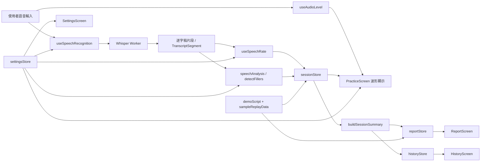

# 說來話長 TalkFit

> 線上展示：<https://talkfit.swift.moe/>

[](https://talkfit.swift.moe/)
[](https://github.com/swiftruru/SpeakCoach-TalkFit)
[](https://react.dev/)
[](https://www.typescriptlang.org/)
[](https://vite.dev/)
[](https://tailwindcss.com/)
[](https://zustand-demo.pmnd.rs/)


TalkFit 是一個以 iOS 體驗為目標打造的互動式 Web 原型，主題聚焦在「演講練習時的贅字與語速回饋」。  
使用者可以在單次練習中同時看到即時逐字稿、語速儀表、贅字標記，並在結束後獲得可追蹤的分析報告與歷史紀錄。

---

## 線上展示截圖

> 網站建議使用桌面瀏覽器開啟，以獲得完整的手機框模擬與註解面板體驗。

[](https://talkfit.swift.moe/)

_截圖展示 TalkFit 的分析報告畫面：左側為 iPhone 原型，右側為註解面板，頂部可直接操作示範流程與 Mock 資料。_

---

## 為什麼是 TalkFit

### 這個產品想解決什麼？

練演講、做簡報、準備產品展示時，最難察覺的往往不是內容，而是自己聽不到的語言習慣：  
例如「嗯」、「然後」、「這個」、「對不對」，或是因為緊張而不自覺越講越快。

這些問題通常有三個痛點：

- 自己事後回聽很痛苦，也很少有人真的願意反覆聽自己的錄音
- 朋友或同事不一定會直接指出你的口頭禪
- 等到正式上台才發現問題，已經來不及修正

TalkFit 的核心概念，就是把這些原本只能「事後懊悔」的問題，提前變成「練習當下就能感受到」的回饋。

### 為什麼用這種方式設計？

- **即時回饋**：使用者練習時就能看到語速與贅字變化，而不是只拿到最後一份靜態報告
- **低打擾提醒**：產品概念是以裝置端辨識與輕量提醒為核心，不打斷使用者節奏
- **可追蹤進步**：每次練習留下報告與歷史趨勢，讓「我好像有比較好」變成可驗證的變化
- **先用原型驗證產品價值**：在真正進入 iOS 實作前，先把資訊架構、互動節奏、資料呈現方式跑通

### 這個原型想證明什麼？

這個原型不是單純把畫面做漂亮，而是要驗證以下幾件事：

1. 使用者能不能在 20 秒內理解產品價值
2. 即時逐字稿、贅字標記與語速資訊能不能形成一個清楚的回饋閉環
3. 報告頁與歷史頁是否足以支撐「持續練習」的動機
4. 未來移植到 iOS / Apple Intelligence on-device 流程時，互動模型是否已經成熟

---

## 核心功能

- **即時語音辨識**：目前 Web 原型以 Whisper Web Worker 模擬裝置端辨識流程，正式產品方向則對齊 Apple Intelligence
- **贅字偵測**：在逐字稿中即時標記填充音、連接贅詞、指示贅詞與慣性尾句
- **語速儀表板**：以圓弧儀表即時顯示字／分鐘，並用顏色區分偏慢、適中、偏快
- **語速曲線圖**：在報告頁中回看整段練習的語速波動與建議區間
- **流暢度評分**：依據贅字頻率與語速表現給出 A+ ~ D 的簡化評分
- **歷史趨勢紀錄**：累積每次練習結果，觀察贅字數量與整體表現變化
- **練習情境設定**：支援 `面試自介`、`專題簡報`、`Demo Pitch`，一鍵同步語速範圍與預設贅字類型
- **自訂贅字清單**：可開關預設詞，也能新增自訂贅字，保留個人化調整
- **無麥克風示範流程**：點擊 `開始示範` 後，先跑示範回放，再自動導覽重點頁面
- **註解面板**：每個畫面都有對應說明，方便作品集展示、課堂展示與評審導覽

---

## 畫面一覽

| 畫面 | 說明 |
|------|------|
| 首頁 | 顯示本週練習次數、平均贅字、每日趨勢與今日提醒 |
| 練習中 | 顯示錄音狀態、語速儀表、音量波形、即時逐字稿 |
| 分析報告 | 顯示平均語速、贅字排行、語速曲線、逐字稿標記與匯出操作 |
| 歷史紀錄 | 顯示累積練習統計、趨勢圖與每次練習列表 |
| 設定 | 可調整偵測開關、情境設定、贅字清單、語速範圍、語言與回饋方式 |

---

## 架構 / 資料流



### 資料流重點

- **輸入層**：麥克風音訊由 `useSpeechRecognition` 與 `useAudioLevel` 分別處理文字辨識與波形視覺化
- **分析層**：逐字稿片段會經過 `useSpeechRate`、`detectFillers`、評分邏輯，產生語速、贅字與摘要資料
- **狀態層**：練習中狀態放在 `sessionStore`；練習結束後整理成 `reportStore` 與 `historyStore`
- **設定層**：`settingsStore` 控制語速範圍、情境設定、贅字清單、語言與回饋方式
- **展示層**：`PracticeScreen`、`ReportScreen`、`HistoryScreen`、`SettingsScreen` 各自訂閱對應 store 狀態
- **示範層**：`demoScript` 與 `sampleReplayData` 可在不開麥克風的情況下重現完整產品價值

---

## 技術堆疊

| 分層 | 技術 |
|------|------|
| 框架 | React 19 + TypeScript + Vite |
| 樣式 | Tailwind CSS + CSS Variables |
| 狀態管理 | Zustand（含 `localStorage` 持久化） |
| 動畫 | Framer Motion |
| 圖表 | Recharts |
| 語音辨識 | `@xenova/transformers` + Whisper Web Worker |
| 音訊視覺化 | Web Audio API |

---

## 快速開始

```bash
npm install
npm run dev
```

啟動後請打開終端機顯示的本機網址。Vite 預設通常是 <http://localhost:5173>，但如果該連接埠已被占用，會自動改用其他埠號。

---

## 頂部按鈕說明

| 按鈕 | 功能 |
|------|------|
| `✦ 設計動機` | 開啟產品概念與參賽動機說明 |
| `✦ Mock 資料` | 一鍵載入示範用練習紀錄與報告 |
| `▶ 開始示範` | 先播放示範回放，再自動導覽報告、首頁、歷史與設定 |
| `設定收音裝置` | 選擇麥克風來源 |
| `亮色 / 暗色` | 切換主題 |

---

## 專案結構

```text
src/
├── screens/          # 各主畫面：首頁、練習、報告、歷史、設定
├── components/
│   ├── shell/        # PhoneFrame、StatusBar、TabBar 等外框元件
│   ├── MicSelector   # 麥克風裝置選擇器
│   └── AboutSection  # 產品概念與設計故事
├── demo/             # 示範流程、示範回放資料、overlay
├── hooks/            # 語音辨識、語速計算、音量分析、拖曳捲動
├── stores/           # navigation、session、report、history、settings 等狀態
├── lib/              # 分析邏輯、評分、贅字資料、情境設定、示範資料
├── annotation/       # 註解面板與各頁註解內容
└── types/            # 共用型別

public/
├── whisperWorker.js  # Whisper 推論 Worker
├── transformers.min.js
└── app-icon.png

docs/
└── images/
    └── talkfit-live-site-report.png
```

---

## 備註

- 首次載入會下載 Whisper base model（約 75 MB）並快取到 IndexedDB，之後載入速度會快很多
- 波形在錄音時會持續動畫；即使麥克風不可用，也會以 demo sine-wave 維持視覺回饋
- `開始示範` 不需要麥克風權限，會透過腳本化示範資料展示產品價值
- 套用情境設定後，若使用者手動調整語速滑桿或贅字清單，系統會自動切回 `custom`
- 所有練習資料都保留在瀏覽器端的 `localStorage`，不會上傳到雲端
